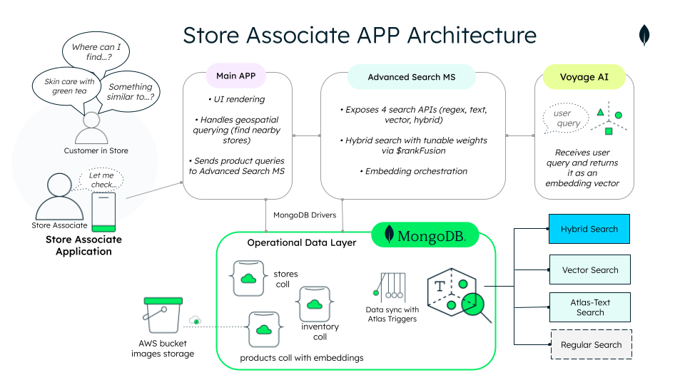

# 🛍️ Store Associate App Demo – From Data Silos to Smart Service with MongoDB Atlas

This README helps developers understand the purpose, structure, and deployment process of this unified commerce demo.

---

## 🔎 Overview

This demo showcases a store associate application built on **MongoDB Atlas**, designed to streamline **product discovery** and **inventory visibility** as part of a **unified commerce strategy**.

Unified commerce connects all sales channels, data, and backend systems into a single, real-time platform—delivering a complete view of the business and enabling consistent, personalized customer experiences.


Powered by MongoDB’s flexible document model, the app unifies product and inventory data into one operational layer. From classic search to semantic and hybrid search—including geospatial queries to check nearby store availability—this experience demonstrates how unified commerce becomes actionable by giving store associates accurate data to serve with speed, clarity, and confidence.

---

## 🎯 Demo Goals

- **Demonstrate how MongoDB Atlas enables unified, real-time operational data through flexible modeling.**
  - The document model allows you to organize data for efficient performance and retrieval. This demo presents just one example of what's possible: a `products` collection with an embedded `inventorySummary` that keeps product and inventory data connected, current, and optimized for quick access. Inventory changes are tracked separately and synced into product documents using **Atlas Triggers**, maintaining a live, store-level view in real time.

- **Showcase advanced, intelligent product discovery with MongoDB Atlas:**
  - Regular search (regex)
  - Full-text search using Atlas Search
  - Semantic vector search (via Voyage AI embeddings)
  - Hybrid search (RRF fusion of text and vector results)
  - Geospatial queries to find nearby availability
  - Comming soon...Boost promotions to align with sales goals
  - Comming soon...Image-based product search using multimodal embeddings


- **Use clean architecture to structure the advanced search microservice**
    This demo implements advanced search logic in a dedicated microservice using a modular, layered architecture. It separates the API layer, use-case logic, and infrastructure concerns—making the microservice easier to test, extend, and maintain over time. Key benefits include:
      - Swappable AI providers: Easily integrate or replace embedding providers (e.g., switching from Voyage AI to Bedrock, or an internal vector service) by isolating vector generation behind an interface.
      - Extensible search logic: Add new retrieval strategies or post-processing steps, such as rule-based re-rankers, personalization layers, or business-logic filters—without touching core orchestration code
      - Multi-channel reuse: Expose the same unified search logic through different entry points like REST, GraphQL, or event-based consumers—enabling consistent behavior across web apps, mobile, or conversational agents

---

## 🧱 Architecture Overview



| Component | Description |
|----------|-------------|
| **Frontend (Next.js)** | Mini-monolith app that handles UI and basic MongoDB queries. Manages geospatial logic locally (finding stores with stock nearby) and delegates advanced product search to the microservice. |
| **Advanced Search Microservice (Python)** | Cleanly architected FastAPI service that performs 4 types of search and coordinates query embeddings with Voyage AI. |
| **MongoDB Atlas** | Core operational data layer with 3 collections: `products`, `inventory`, and `stores`. Stores text and image embeddings used for semantic and image-based search.• Each product embeds a store-level inventorySummary. One Atlas Trigger listens for key inventory changes and syncs product documents. A second scheduled trigger simulates daily inventory updates to maintain realism and consistency. |
| **Embeddings & AI Integration** | Embeddings were generated using **Voyage AI** and stored in MongoDB. The same model is used for query embedding generation to ensure consistency. The architecture also supports swapping in alternative providers. |

👉 This README guides deployment of the full experience.  
👉 For technical deep dives, see the [Frontend README](./frontend/README.md) and [Advanced Search Microservice README](./backend/advanced-search-ms/README.md).

🗒️ _Tip_: Check the [ADR documentaion](./docs/adr/) folder for architectural rationales and design choices.

---

## 🗂 Folder Structure

```bash
retail-unified-commerce/
├── frontend/               # Next.js app
├── backend/
│   └── advanced-search-ms/  # FastAPI-based search service
├── docs/                  # ADRs, helper scripts, setup docs and more.
├── docker-compose.yml     # Orchestrates services
└── Makefile               # Dev commands
```

---

## 🐳 Getting Started – Run the Full Demo Locally

### 🔧 Prerequisites

- [MongoDB Atlas account](https://www.mongodb.com/cloud/atlas/register) (Free Tier works)
- [Demo dataset](./docs/setup/collections/README.md/) - we provide JSON files for the 3 required collections:
  - [products collection with embeddings](./docs/setup/collections/retail-unified-commerce.products.json/)
  - [inventory collection](./docs/setup/collections/retail-unified-commerce.inventory.json/)
  - [stores collection](./docs/setup/collections/retail-unified-commerce.stores.json/)
- [Index definitions](./docs/setup/indexes/README.md/) in:
  - [search index](./docs/setup/cindexes/search-index.json/)
  - [vector index](./docs/setup/cindexes/vector-index.json/)
- Environment configuration files (.env) for each app, using .env.EXAMPLE as a template:
  - [frontend](./frontend/.env.EXAMPLE)
  - [advanced-search-ms](./backend/advanced-search-ms/.env.EXAMPLE)
- A [Voyage AI API key](https://www.voyageai.com/) added to the backend `.env`
- Installed tools:
  - Docker + Docker Compose
  - Node.js v20 (if running frontend separately)
  - Python 3.11 + Poetry (if running backend separately)

---

### 🚀 Start Locally with Docker Compose and Makefile

```bash
git clone https://github.com/mongodb-industry-solutions/retail-unified-commerce.git
cd retail-unified-commerce
make build
```

#### Common Commands

| Action                     | Command       |
|---------------------------|---------------|
| Build & start             | `make build`  |
| Start (no rebuild)        | `make start`  |
| Stop all containers       | `make stop`   |
| Clean containers/images   | `make clean`  |
| View all logs             | `make logs`   |

#### Frontend Commands

| Action         | Command            |
|----------------|--------------------|
| Build frontend | `make front-build` |
| Start frontend | `make front-up`    |
| Stop frontend  | `make front-stop`  |
| View logs      | `make front-logs`  |

#### Backend Commands

| Action         | Command            |
|----------------|--------------------|
| Build backend  | `make back-build`  |
| Start backend  | `make back-up`     |
| Stop backend   | `make back-stop`   |
| View logs      | `make back-logs`   |

---

## 🧠 Why MongoDB for Unified Commerce

MongoDB Atlas is a powerful **Operational Data Layer (ODL)** for unified commerce. It simplifies how retailers consolidate, serve, and act on critical data across channels.


### Key Advantages

- **Flexible document model**  
   Easily model rich, complex retail data—such as products with per-store inventory, pricing, or media assets—in a single document. No rigid schemas or painful joins.

- **Built-in advanced search**  
   With Atlas Search and Vector Search, retailers can implement full-text, semantic, hybrid, and even image-based product discovery directly on operational data—without needing separate search or vector databases.

- **Support for modern AI-driven apps**  
  Store and query multimodal embeddings, trigger real-time updates, and support smart recommendations with minimal complexity. Atlas is built to support AI-native experiences with operational-grade performance.

- **Simplified architecture**  
  Reduce ETL complexity, avoid data duplication, and enable real-time updates with features like Atlas Triggers, Change Streams, and Online Archive. Run analytics or AI workloads on dedicated nodes without affecting core performance.

- **🌟 What’s Next: Native AI Simplicity**  
 MongoDB will soon offer native support for automatic embedding generation and reranking—making intelligent search and recommendations even easier to build.
 
 👉 _Read more in [this blog post](#)_.

---

## 👥 Authors

**Use Case & Implementation**
- Prashant Juttukonda – Principal  
- Rodrigo Leal – Principal  
- Genevieve Broadhead – Global Lead, Retail Solutions

**Technical Design & Development**
- Angie Guemes – Developer & Maintainer  
- Florencia Arin – Developer & Maintainer

---

## 📚 Related Demo Content Package

- 🎥 YouTube Video – _coming soon_
- 📄 Solution Library – _coming soon_
- 📝 Blog – _coming soon_

⭐ If you found this useful, consider giving the repo a star!

---

## 📄 License

© 2025 MongoDB. All rights reserved.  
This demo is for educational purposes only. Commercial use is prohibited without written permission from MongoDB.
