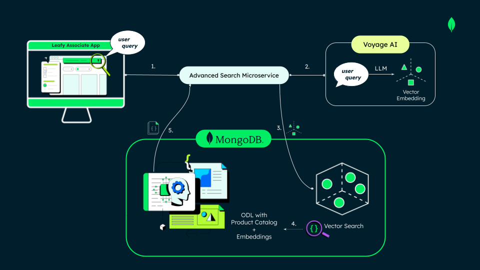
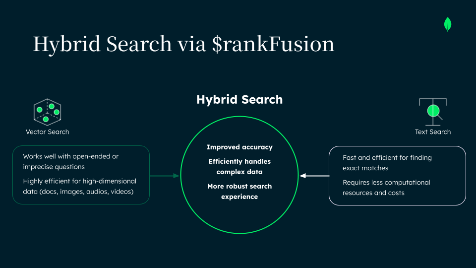

# Advanced Search Microservice

> **Product Discovery with MongoDB Atlas & Voyage AI – keyword, full-text, vector, and hybrid RRF search in one endpoint.**  
> 🖼 **Image-based search — Coming Soon!**

This [microservice](../../docs/adr/adr-2025-07-advanced-search-microservice-backend-isolation.md/) powers the **Product Discovery** feature in the Unified Commerce demo.  
Clients send a **free-text query** scoped to a **store**, and choose one of four search strategies.  
The response is a paginated list of relevant products with a **relevance score**.  
Brand Amplification: optional feature to boost specific brands in the ranking by assigning a configurable level of priority (`1 for low boost `, `3 for medium boost`, or `3 for high boost`).


## What is Brand Amplification?
- It is particularly valuable in real-world retail scenarios where store associates must not only meet customer needs but also align with business objectives.  
  For example, during a given week associates may need to **recommend specific brands** tied to commercial agreements or sales targets.  
  Brand Amplification ensures that, among all relevant results, products from those prioritized brands appear more prominently.  
  This helps associates balance personalized recommendations with operational KPIs, enabling **real-time dynamics** such as weekly sales goals related to vendor agreements.


-   [Clean Architecture](../../docs/adr/adr-2025-07-clean-architecture-advanced-search-ms.md/) (domain → application → infrastructure → interface).
- MongoDB Atlas Lucene `$vectorSearch` **and** `$search` text indexes.
- Reciprocal Rank Fusion to blend vector & text results.
- Voyage AI embeddings (`voyage‑3‑large`).
- FastAPI on Python 3.11.

---

## 1 – Search Strategies

| Option | Use Case Class           | Engine / Technique                                                                                  | Typical Use Case                                 | Brand Amplification |
| ------ | ------------------------ | --------------------------------------------------------------------------------------------------- | ------------------------------------------------ | ------------------- |
| **1**  | `KeywordSearchUseCase`   | Regex / prefix match on `productName`                                                               | Name match                                       | ❌ Not supported    |
| **2**  | `AtlasTextSearchUseCase` | Atlas Lucene `$search` (full-text)                                                                  | Keyword search with boosting, fuzziness, synonyms| ✅ Supported        |
| **3**  | `VectorSearchUseCase`    | Lucene `$vectorSearch` (k-NN, cosine)                                                               | Semantic / natural-language queries              | ✅ Supported        |
| **4**  | `HybridSearchUseCase`    | Combines options 2 & 3 (Text + Vector) with configurable weights (`weightVector`, `weightText`). Supports **Reciprocal Rank Fusion (RRF)** or **Score Fusion** for result blending | Balance keyword relevance + semantic meaning     | ✅ Supported        |


> **Dynamic weights in option 4:**  
> The client can send extra parameters (`weightVector`, `weightText`) to fine-tune the influence of each search type at runtime.  
> If these weights are not provided, the service defaults to `weightVector=0.5` and `weightText=0.5`.  

> **Fusion mode in option 4:**  
> Clients can also specify a `fusionMode` parameter to control how text and vector results are blended.  
> Supported values are **`rrf`** (Reciprocal Rank Fusion) and **`scoreFusion`** (normalized weighted scores).  
> If `fusionMode` is not defined, the service defaults to **`rrf`**.  

> **Brand Amplification in options 2–4:**  
> Clients may optionally provide a list of brands with a boost level (`1`, `2`, or `3`) to prioritize those brands in the ranking.  
> If the `brandAmplification` field is not provided, the search runs normally without amplification.  
> This is especially useful for real-time retail scenarios, such as highlighting promoted brands during weekly campaigns or meeting vendor sales targets.

---

## 2 – Environment Variables

```dotenv
# MongoDB Atlas
MONGODB_URI=mongodb+srv://<user>:<pass>@<cluster>.mongodb.net/
MONGODB_DATABASE=retail-unified-commerce
PRODUCTS_COLLECTION=products
VECTOR_INDEX_NAME=product_text_vector_index
TEXT_INDEX_NAME=product_atlas_search
EMBEDDING_FIELD_NAME=textEmbeddingVector

# Voyage AI
VOYAGE_API_URL=https://api.voyageai.com/v1
VOYAGE_API_KEY=<your-token>
VOYAGE_MODEL=voyage-3-large
```
---

## 3 – Running Locally

### Prerequisites

* Python 3.11
* [Poetry](https://python-poetry.org/)

### Backend Only (Poetry)

```bash
# 1) Navigate to the microservice
cd backend/advanced-search-ms

# 2) Create environment & install dependencies
poetry env use python3.11
poetry install

# 3) Configure environment variables
cp .env.example .env
# -> Fill in MongoDB credentials and VOYAGE_API_KEY

# 4) Start the dev server
poetry run uvicorn main:app --reload --port 8000
```

Verify:

* **API Docs**: [http://localhost:8000/docs](http://localhost:8000/docs)
* **Health Check**: [http://localhost:8000/health](http://localhost:8000/health)

---

## 4 Backend + Frontend Together with Docker and Makefile

To run the microservice together with the frontend, follow the steps in the [main project README](../../README.md).

---

## 4 – Example Requests

### Option 1 (Keyword)
```http
POST /api/v2/search
Content-Type: application/json

{
  "query": "matcha",
  "storeObjectId": "684aa28064ff7c785a568aca",
  "option": 1,
  "page": 1,
  "page_size": 20
}
```

### Option 2 (Full-text)

```http
POST /api/v2/search
Content-Type: application/json

{
  "query": "green tea cleanser",
  "storeObjectId": "684aa28064ff7c785a568aca",
  "option": 2,
  "page": 1,
  "page_size": 20,
  "brandAmplification": [
    { "name": "Oatly", "boostLevel": 3 },
    { "name": "Alpro", "boostLevel": 2 }
  ]
}

```
### Option 3 (Vector)



```http
POST /api/v2/search
Content-Type: application/json

{
  "query": "gentle antioxidant cleanser",
  "storeObjectId": "684aa28064ff7c785a568aca",
  "option": 3,
  "page": 1,
  "page_size": 20,
  "brandAmplification": [
    { "name": "MCaffeine", "boostLevel": 2 },
    { "name": "Innisfree", "boostLevel": 1 },
    { "name": "Olay", "boostLevel": 3 }
  ]
}
```

### Option 4 (Hybrid with weights and fusion mode)

```http
POST /api/v2/search
Content-Type: application/json

{
  "query": "green tea skin care",
  "storeObjectId": "684aa28064ff7c785a568aca",
  "option": 4,
  "page": 1,
  "page_size": 20,
  "weightVector": 0.5,
  "weightText": 0.5,
  "fusionMode": "rrf",
  "brandAmplification": [
    { "name": "Innisfree", "boostLevel": 1 },
    { "name": "Olay", "boostLevel": 2 },
    { "name": "The Body Shop", "boostLevel": 3 }
  ]
}

```



**How it works (high level):**
1. Generate an embedding for `query` via Voyage AI (`voyage-3-large`).  
2. Execute **two** searches scoped to `storeObjectId`:  
   - **Vector**: `$vectorSearch` over `EMBEDDING_FIELD_NAME` (cosine similarity).  
   - **Text**: `$search` full-text query over relevant fields (with brand boosts if `brandAmplification` is provided).  
3. Fuse both result lists using the selected `fusionMode`:  
   - **`rrf` (Reciprocal Rank Fusion)** – default if no mode is specified.  
   - **`scoreFusion`** – combines normalized scores using the provided weights.  
4. If no `weightVector`/`weightText` are defined, the service defaults to `0.5 / 0.5`.  
5. If no `brandAmplification` field is provided, the search runs normally without amplification.  

> **Tips:**  
> - Explore / Discover: favor semantics → `weightVector=0.6–0.8`.  
> - Precise search / Known catalog: favor text → `weightText=0.6–0.8`.  

---
## 5 –  API Responses

The search API returns consistent JSON responses.

- **200 (OK)** → Request is valid, even if no products are found.
- **400 (Bad Request)** → Request is invalid (validation/business rules).
- **500 (Internal Server Error)** → Unexpected failure processing the request.

### 200 – OK

The request was processed successfully.

```jsonc
{
  "total_results": 141,
  "total_pages": 8,
  "products": [
    {
      "id": "685bfe2d3d832cf7e16155f7",
      "productName": "Green Tea Quick Face Detox Kit",
      "brand": "MCaffeine",
      "price": {
        "amount": 25.79,
        "currency": "USD"
      },
      "quantity": "5 pcs",
      "category": "Beauty & Hygiene",
      "subCategory": "Face Care",
      "absoluteUrl": "https://www.bigbasket.com/pd/40193676/mcaffeine-green-tea-quick-face-detox-kit-5-pcs/",
      "aboutTheProduct": "The Green Tea Quick Face Detox Kit is ideal for you if you’re looking for a complete detox of your face...",
      "imageUrlS3": "https://retail-unified-commerce.s3.amazonaws.com/products/685bfe2d3d832cf7e16155f7.png",
      "inventorySummary": [
        {
          "storeObjectId": "684aa28064ff7c785a568aca",
          "storeId": "store-001",
          "sectionId": "S02",
          "aisleId": "I21",
          "shelfId": "SH211",
          "inStock": true,
          "nearToReplenishmentInShelf": false
        }
      ],
      "score": 0.0148
    }
  ]
}
```
**Example (no results):**

```json
{
  "total_results": 0,
  "total_pages": 0,
  "products": []
}
```
## 400 – Bad Request

Returned when **validation** or **business rules** fail.

### Common cases
- `brandAmplification` sent with `option=1`.
- `brandAmplification` present but empty.
- Any `boostLevel` not in `[1,2,3]`.
- Invalid `page_size` (must be `1..100`) or `page` (`>=1`).
- Invalid `fusionMode` (must be `rrf` or `scoreFusion`).

### Examples

**Invalid boost level:**
```json
{
  "error": {
    "code": "INVALID_BOOST_LEVEL",
    "message": "boostLevel must be one of [1,2,3]"
  }
}
```
**Brand amplification not allowed for option=1:**
```json
{
  "error": {
    "code": "INVALID_OPTION_FOR_BRAND_AMP",
    "message": "brandAmplification is only supported for options {2,3,4}"
  }
}
```

## 500 – Internal Server Error

Returned when the service fails unexpectedly (e.g., DB/connectivity issues, embedding provider failure).

**Example:**
```json
{
  "error": {
    "code": "INTERNAL_ERROR",
    "message": "An unexpected error occurred. Please try again later."
  }
}
```

## Notes

- If `weightVector` / `weightText` are **omitted** in option 4, defaults `0.5 / 0.5` are applied (no error).
- If `fusionMode` is **omitted** in option 4, default is `rrf` (no error).
- If `brandAmplification` is **omitted**, the search runs normally without amplification.

