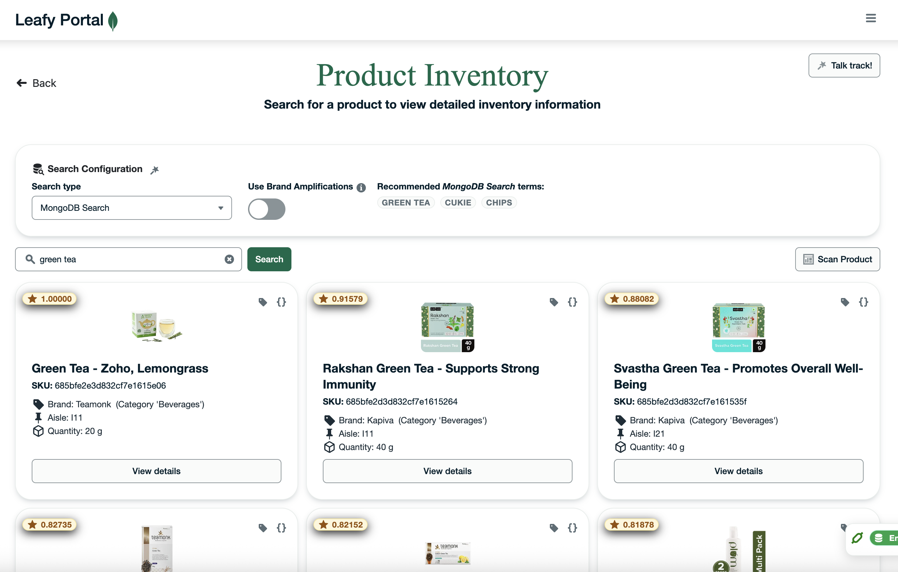
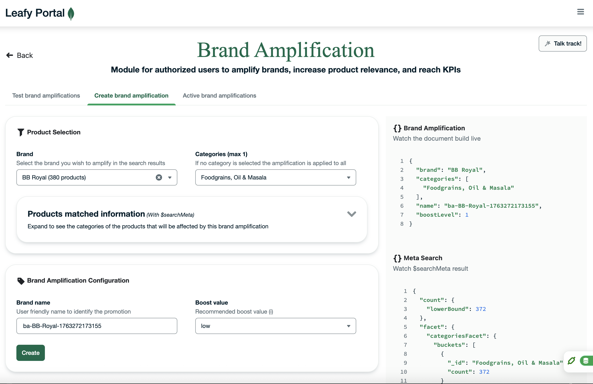

# Store Portal – User Guide

Welcome to the **Store Portal**, an interactive demo designed to showcase how grocery retailers can empower their store associates, brand managers, and retail operators with a unified view of store operations.
This portal demonstrates how **Unified Commerce**—powered by MongoDB Atlas—enables seamless access to real-time inventory, enriched product data, and brand-driven campaigns, all from a single platform.

This guide will walk you through the overall structure of the demo and provide an overview of each module.  

---

## ✨ What Is the Store Portal?

The **Store Portal** is a grocery-store management application built to demonstrate the power of a **360° operational view** across key retail processes. It provides:

- **Real-time store inventory visibility**  
- **AI-augmented search capabilities**  
- **Brand amplification tools for retail teams**  
- **A unified experience** across store operations  

The goal is to show how a modern retailer can break down silos and empower associates with actionable insights delivered via a single, unified interface.

---

# 📦 Modules Overview

The Store Portal currently includes two core modules:

---

## 1. Store Inventory

Empower store associates with a **real-time 360° view of store inventory**, including product attributes, aisle/shelf location, availability, and metadata enriched through AI-driven search.

**Designed for:**  
🧑‍🏬 Store associates  
🛒 Customer-facing retail employees  

### Features
- Searchable inventory with smart/semantic search  
- Product details with location inside the store  
- SKU-level availability  
- Ideal for assisting customers efficiently on the store floor  

### Screenshot

### Module Documentation
👉 [Store Inventory Module README](./modules/product-inventory/README.md)

---

## 2. Brand Amplification

A module for store managers and brand owners to **create, configure, and manage brand amplification campaigns**.  
These amplifications help boost product visibility inside the digital or physical store catalog.

**Designed for:**  
📢 Brand managers  
📊 Store managers  
🔐 Authorized retail personas  

### Features
- Create and manage brand amplification campaigns  
- Highlight selected products in the catalog  
- Configure titles, images, and messaging with a visual interface  

### Screenshot

### Module Documentation
👉 [Brand Amplification Module README](./modules/brand-amplification/README.md)

---

# 🛠 Getting Started

To explore the full demo, follow the setup instructions in each module’s README or any global installation instructions included in this repository.

---

