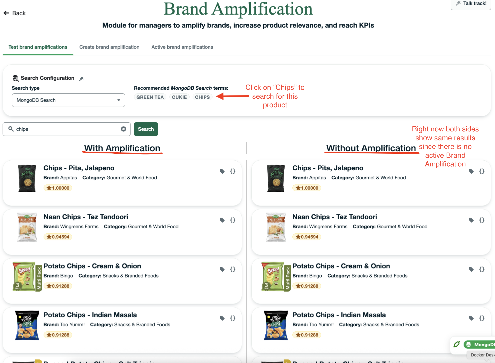
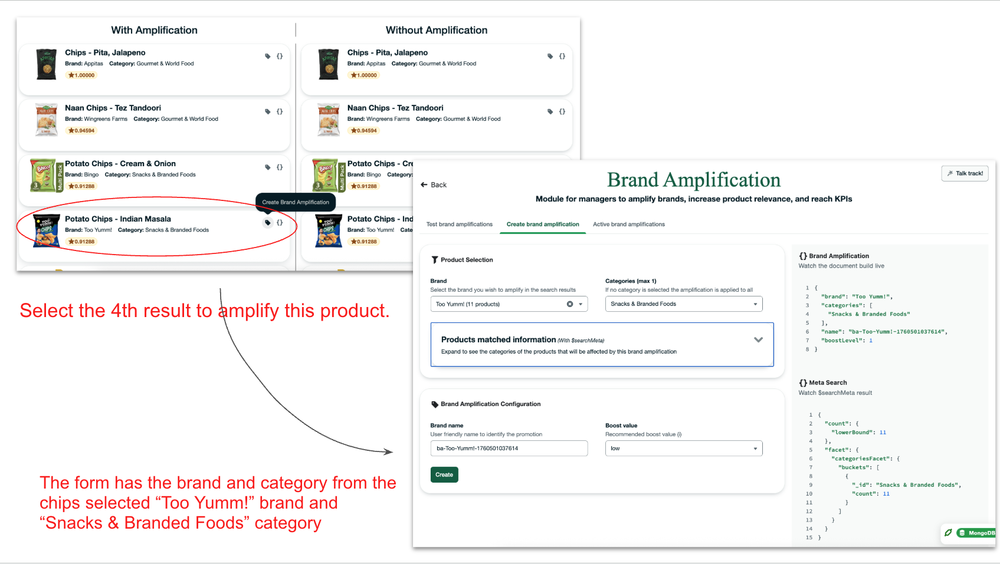
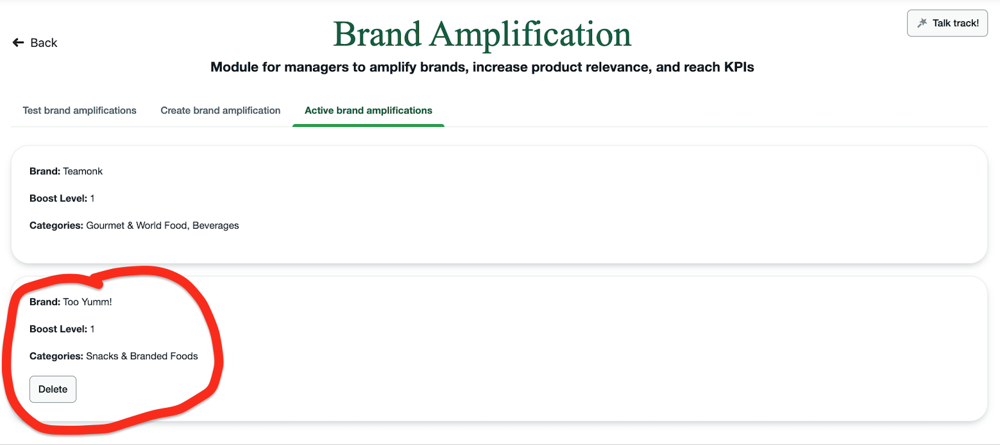
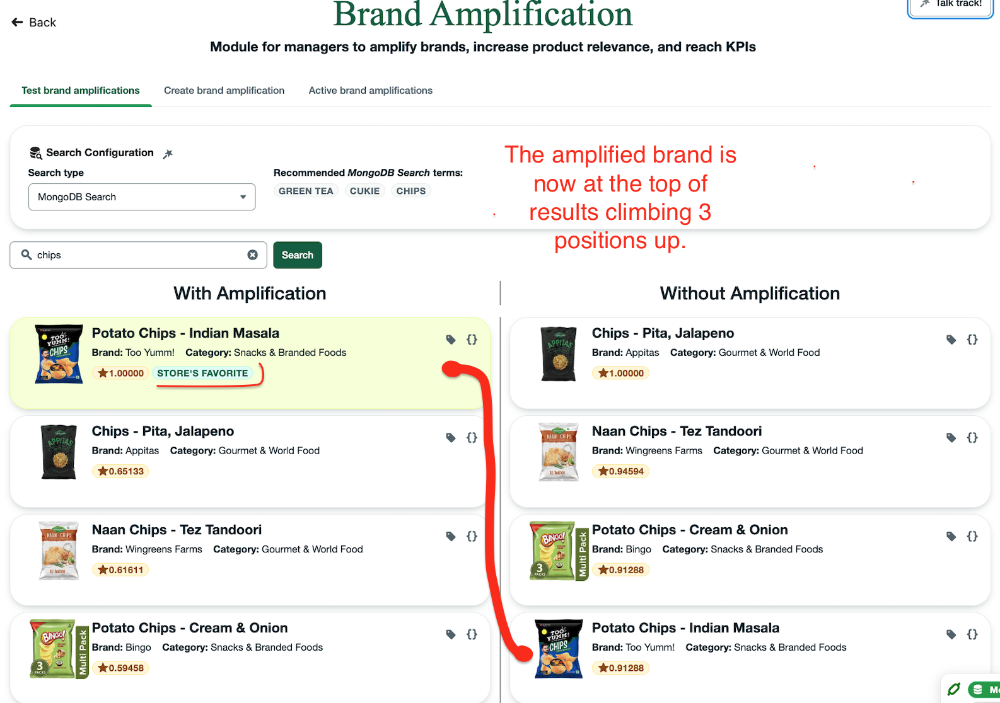
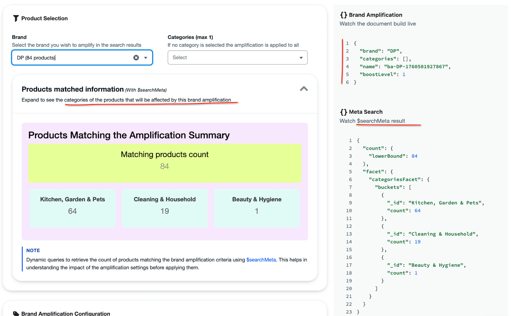

# 📢 Brand Amplification Module – User Guide

The **Brand Amplification** module allows you to create and manage product amplifications that boost visibility inside the Store Portal.  
Amplifications help you highlight priority products, promote brands, and guide what your store associates or digital catalog users will see first.

This guide explains what this module is for, how to navigate it, and how to use it effectively.

---

# 🚀 Getting to This Module

There are two ways to open the **Brand Amplification** module:

### **Option 1: From the landing page**
1. Open the Store Portal.
2. Locate the card titled **“Brand Amplification.”**
3. Click **“Visit Module.”**

### **Option 2: Direct link**
Open your browser and navigate to: /brand-amplification

---

# 🎯 What You Can Do in This Module

Inside this module, you can:

- Create new brand amplification campaigns.
- Select products you want to feature or boost.
- Help your store surface important products more prominently.
- Influence search results inside the Store Inventory module.

Brand amplifications act like “featured product rules” that elevate visibility based on retail or brand strategy.

---

# 👣 How to Use This Module

Follow these steps to explore and demo the **Brand Amplification** module in the Store Portal.

---

## **1. Test Brand Amplifications**

1. Go to the **“Test brand amplifications”** tab.
2. Search for any product (e.g., *“Chips”*).  
   You will see **two result columns**:
   - The **left column** applies Brand Amplifications.  
   - The **right column** does not apply any amplification.

 

---

## **2. Create a Brand Amplification**

1. Scroll to a product you want to amplify.
2. Click the **Tag icon** to create a new Brand Amplification.
3. You will be taken to the **“Create Brand Amplification”** tab.  
   The form will automatically populate with the brand and category of the selected product.

 

---

## **3. Save Your Amplification**

1. Click **“Create”** to add the new Brand Amplification entry.
2. You will be redirected to the **“Active brand amplification”** tab.  
   Your new entry will appear at the bottom of the list.

 

---

## **4. Verify the Amplification in Search**

1. Return to the **“Test brand amplifications”** tab.
2. Repeat your product search.
3. You will now see the amplified brand highlighted, increasing its visibility in the results.

 

---

## **📘 Extra Notes**

- You can modify the form (categories, brand, etc.) to see how the **$searchMeta** information and dynamic product document change.  
- This allows you to experiment and understand how brand amplifications influence product ranking.

 

# 📘 How Product Ranking Changes

When amplifications are active:

- Amplified products are ranked higher.
- Search results may display a **relevance score badge**.
- A curly-brace icon may appear to let you open the full product document.

This demonstrates how the portal blends **search intelligence + business insights** to help you guide product discovery.

---

# ℹ️ Notes

- Amplifications only affect visibility—they do **not** modify product data.
- This module is designed to show how brand and store input can influence search relevance.
- Amplifications can be created or removed at any time.
- This feature works seamlessly with Atlas Search, Atlas Vector Search, and Hybrid Search depending on how the store inventory module is configured.
